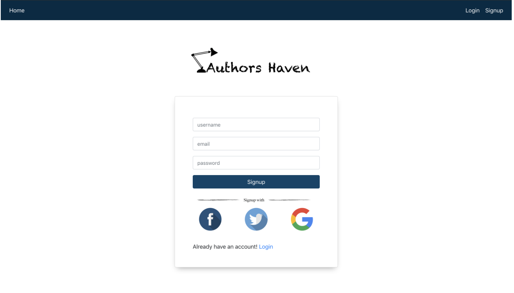
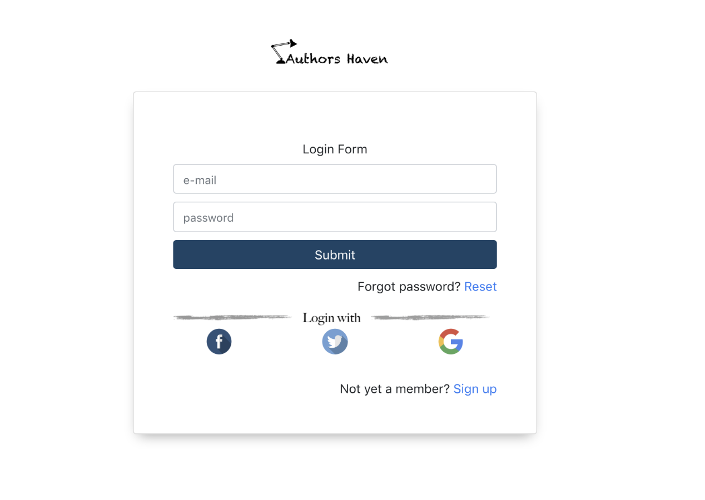
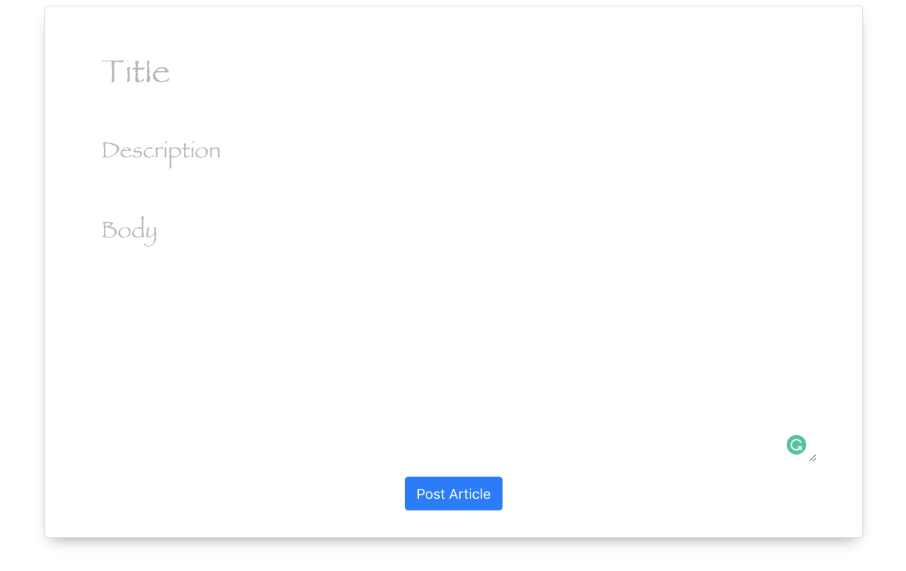
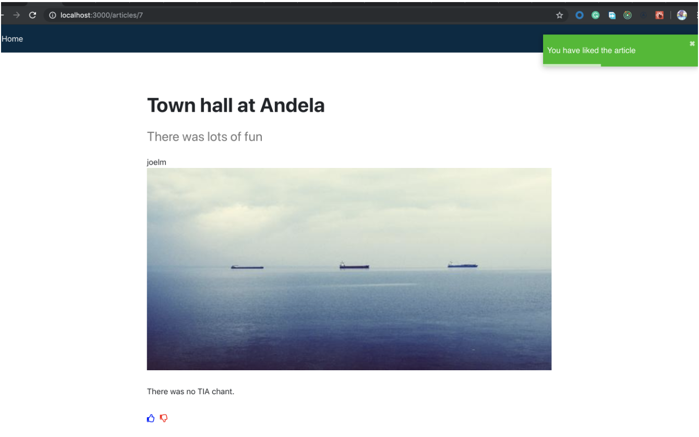

## Author's Haven - A social platform for the creative at heart

     

### Vision

Create a community for like-minded authors to foster inspiration and innovation by leveraging the modern web.

### Illustrations
Register page

Login page

Create article page

Like articles page

### Demo
A live demo of the application is found [here](https://staging-f-invictus.herokuapp.com/)

### Technologies required
- React
- Bootstrap
- NodeJs
- npm 

### Getting started
1. Clone this [repository](https://github.com/andela/ah-frontend-invictus.git)

2. Use your package manager to install dependencies
- `npm install`

3. Start up the server
- `npm start`

4. Head over to its urls in the browser, sign up with either facebook, google or our signup form and get started

### Testing

Run the following command

`npm test -- --coverage`

